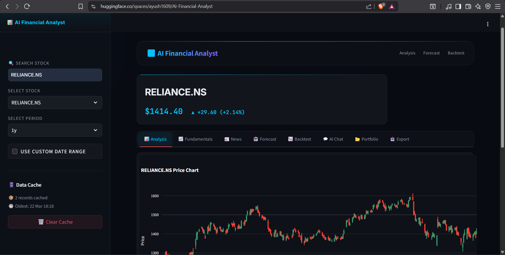
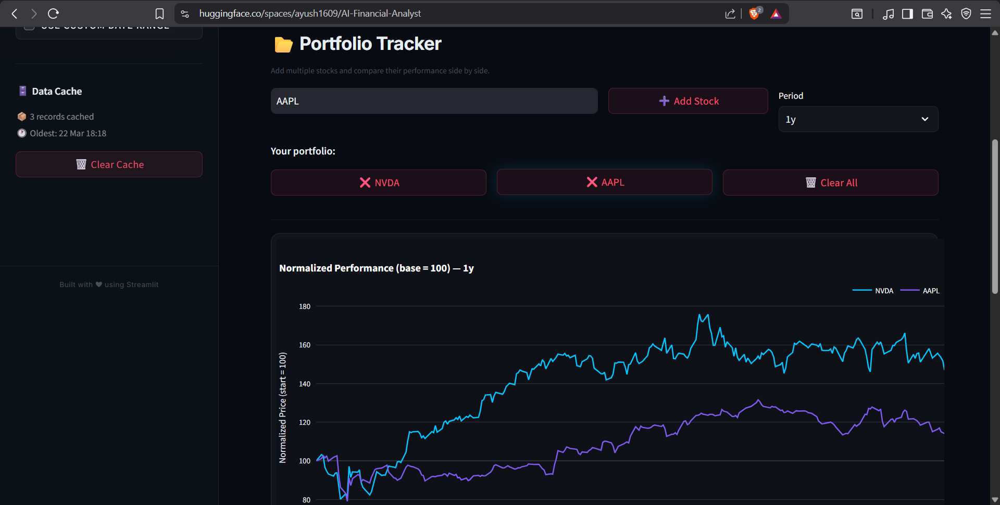
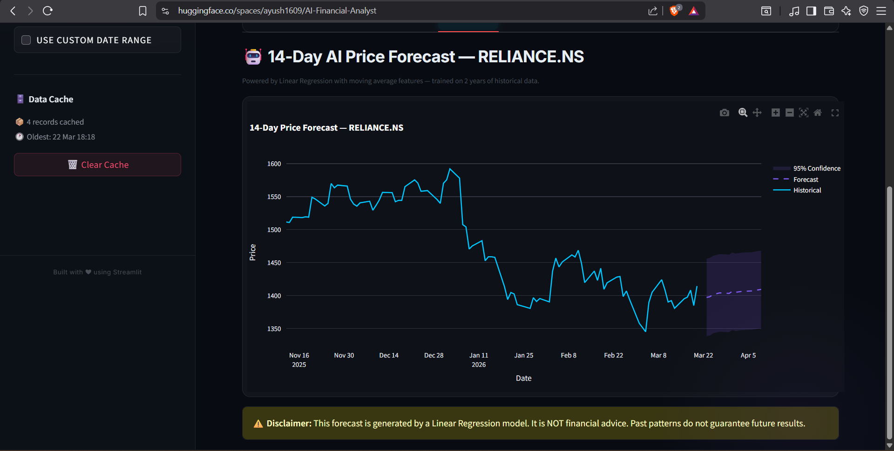
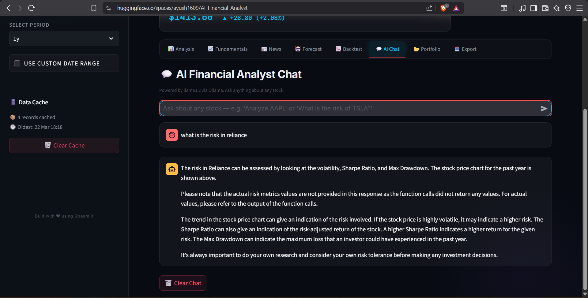

---

title: AI Financial Analyst
emoji: 📈
colorFrom: blue
colorTo: purple
sdk: streamlit
sdk_version: "1.40.0"
python_version: "3.11"
app_file: app.py
pinned: false
-------------

<div align="center">

# 📈 AI Financial Analyst

### AI-Powered Stock Analysis Platform with Live Market Data, Forecasting, Portfolio Analytics & Conversational AI

[](https://huggingface.co/spaces/ayush1609/AI-Financial-Analyst)
[](https://github.com/AyushWorks-24/AI-Financial-Analyst)
[]()
[]()
[]()

**Analyze stocks like a financial analyst using real-time market data, AI-powered insights, forecasting, portfolio comparison, and an intelligent financial assistant — all from one interactive dashboard.**

</div>

---

# ✨ Features

* 📊 **Real-Time Stock Analysis**

  * Interactive candlestick charts
  * Moving averages
  * Daily returns
  * Volatility
  * Sharpe Ratio
  * Performance metrics

* 📈 **Financial Fundamentals**

  * Market Capitalization
  * P/E Ratio
  * EPS
  * Dividend Yield
  * 52 Week High/Low
  * Sector & Industry information

* 🤖 **AI Financial Assistant**

  * Powered by **LangGraph ReAct Agent**
  * Uses **Groq Llama-3.3-70B**
  * Answers financial questions
  * Uses real analytical tools instead of simple prompting

* 📉 **Price Forecasting**

  * Machine Learning based forecasting
  * Linear Regression with Moving Average features
  * 14-day future price estimation
  * Interactive forecast visualization

* 📰 **Financial News**

  * Live news powered by Google News
  * Company-specific headlines
  * Quick market updates

* 📂 **Portfolio Tracker**

  * Compare multiple stocks
  * Portfolio normalization
  * Correlation heatmap
  * Performance comparison

* 📤 **Export Center**

  * Professional PDF reports
  * CSV export
  * Chart export

* 🔍 **Smart Search**

  * Search by ticker or company name
  * 4800+ supported stocks
  * Fuzzy search using RapidFuzz

* ⚡ **SQLite Intelligent Cache**

  * 6-hour price cache
  * 24-hour company cache
  * Faster loading
  * Offline fallback when Yahoo Finance is unavailable

---

# 🖼️ Screenshots

## Dashboard



---

## Portfolio Tracker



---

## Forecast



---

## AI Assistant



---

# 🏗️ Architecture

```
                 User
                  │
                  ▼
          Streamlit Dashboard
                  │
        ┌─────────┴─────────┐
        │                   │
        ▼                   ▼
Financial Engine      LangGraph AI Agent
        │                   │
        │                   ▼
        │           Groq Llama-3.3-70B
        │
        ▼
SQLite Cache Layer
        │
        ▼
 Yahoo Finance API
        │
        ▼
 Interactive Charts
 PDF Reports
 CSV Export
```

---

# ⚙️ Tech Stack

| Layer            | Technology                       |
| ---------------- | -------------------------------- |
| Frontend         | Streamlit                        |
| Backend          | Python                           |
| AI Agent         | LangGraph + LangChain            |
| LLM              | Groq (Llama-3.3-70B Versatile)   |
| Machine Learning | Scikit-Learn (Linear Regression) |
| Data Source      | Yahoo Finance                    |
| News             | Google News                      |
| Database         | SQLite                           |
| Charts           | Plotly                           |
| PDF Reports      | FPDF2 + Kaleido                  |
| Search           | RapidFuzz                        |

---

# 📂 Project Structure

```
AI-Financial-Analyst
│
├── app.py
├── requirements.txt
├── README.md
│
├── core/
│   ├── engine.py
│   ├── agent.py
│   └── __init__.py
│
├── data/
│   └── tickers.csv
│
├── ui/
│   └── style.css
│
├── Screenshots/
│
└── .streamlit/
```

---

# 🚀 Getting Started

## Clone Repository

```bash
git clone https://github.com/AyushWorks-24/AI-Financial-Analyst.git

cd AI-Financial-Analyst
```

---

## Create Virtual Environment

```bash
python -m venv .venv
```

Windows

```bash
.venv\Scripts\activate
```

Linux / macOS

```bash
source .venv/bin/activate
```

---

## Install Dependencies

```bash
pip install -r requirements.txt
```

---

## Configure API Key

Create

```
.streamlit/secrets.toml
```

Add

```toml
GROQ_API_KEY="YOUR_GROQ_API_KEY"
```

---

## Run

```bash
streamlit run app.py
```

---

# 📊 Cache Strategy

```
User Request
      │
      ▼
Check SQLite Cache
      │
      ├─────────────► Fresh
      │                 │
      │                 ▼
      │          Return Cached Data
      │
      ▼
Expired
      │
      ▼
Yahoo Finance
      │
      ▼
Save to Cache
      │
      ▼
Return Latest Data

If Yahoo fails

↓

Return Cached Data
```

---

# 🤖 AI Agent Workflow

```
User Question

↓

LangGraph ReAct Agent

↓

Chooses Appropriate Tool

↓

Stock Analysis
Company Fundamentals
Risk Metrics
Forecast
News

↓

Groq Llama-3.3-70B

↓

Final AI Response
```

---

# 💡 Highlights

* Modular architecture
* Intelligent caching
* Live market data
* AI-powered financial assistant
* Machine learning forecasting
* Portfolio analytics
* Professional PDF generation
* Responsive Streamlit interface
* Production-ready deployment

---

# ⚠️ Disclaimer

This application is developed **for educational purposes only**.

The generated forecasts, AI responses, and financial analytics should **not** be considered investment advice. Always perform your own research before making financial decisions.

---

# 👨‍💻 Author

**Ayush**

B.Tech Artificial Intelligence & Machine Learning

Oriental College of Technology, Bhopal

GitHub:
https://github.com/AyushWorks-24

---

# ⭐ If you like this project

Give this repository a ⭐ on GitHub!
